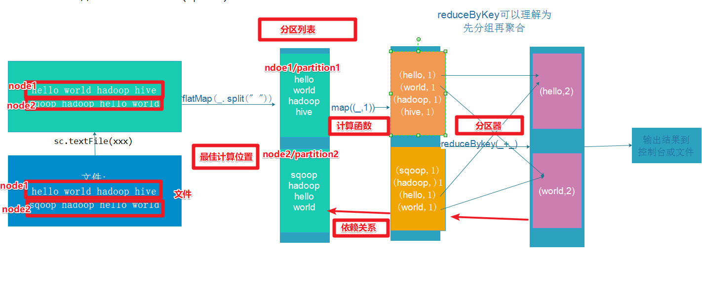
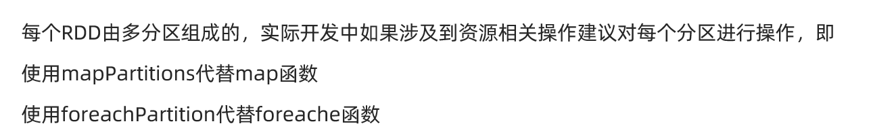
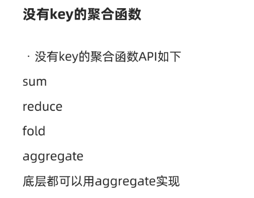
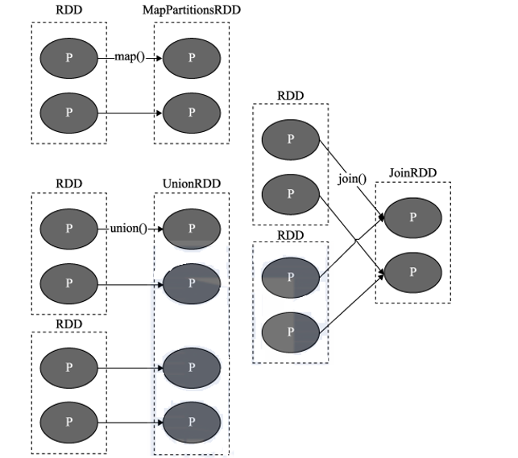

# Spark内核原理及RDD

## 1、项目介绍
&emsp;&emsp;Spark 是一种基于内存的快速、通用、可扩展的大数据分析计算引擎。
  
&emsp;&emsp;本项目学习内容：
* RDD详解
* Spark内核原理
* 搜狗搜索日志分析demo

&emsp;&emsp;本项目属于《Spark系列》：  
* [《Spark环境搭建》](https://github.com/xiaoguangbiao-github/bigdata_spark_env.git)  
* [《Spark内核原理及RDD》](https://github.com/xiaoguangbiao-github/bigdata_spark_core.git)  
* [《SparkStreaming & SparkSql》](https://github.com/xiaoguangbiao-github/bigdata_sparkstreaming_sparksql.git)  
* [《StructuredStreaming & Spark综合案例》](https://github.com/xiaoguangbiao-github/bigdata_structuredstreaming_sparkdemo.git)
* [《Spark3.0新特性 & Spark多语言开发》](https://github.com/xiaoguangbiao-github/bigdata_spark3_languagedevelop.git)

## 2、开发环境

- 语言：scala 2.12.11

- Eclipse/IDEA

- 依赖管理：Maven

- Spark 3.0 + hadoop 2.7


# RDD详解

## why?


## what?

A Resilient Distributed Dataset (RDD), the basic abstraction in Spark. 

RDD:弹性分布式数据集,是Spark中最基本的数据抽象,用来表示分布式集合,支持分布式操作!


## 五大属性

Internally, each RDD is characterized by five main properties:
 - 分区列表: A list of partitions

 - 计算函数: A function for computing each split

 - 依赖关系: A list of dependencies on other RDDs

 - 分区器: Optionally, a Partitioner for key-value RDDs (e.g. to say that the RDD is hash-partitioned)

 - 计算位置：Optionally, a list of preferred locations to compute each split on (e.g. block locations for
   an HDFS file)
   
   

## WordCount中的RDD的五大属性




# RDD的创建

RDD中的数据可以来源于2个地方：本地集合或外部数据源


```java 
package cn.xiaoguangbiao.core

import org.apache.spark.rdd.RDD
import org.apache.spark.{SparkConf, SparkContext}

/**
 * Author xiaoguangbiao
 * Desc 演示RDD的创建
 */
object RDDDemo01_Create {
  def main(args: Array[String]): Unit = {
    //TODO 0.env/创建环境
    val conf: SparkConf = new SparkConf().setAppName("spark").setMaster("local[*]")
    val sc: SparkContext = new SparkContext(conf)
    sc.setLogLevel("WARN")

    //TODO 1.source/加载数据/创建RDD
    val rdd1: RDD[Int] = sc.parallelize(1 to 10) //8
    val rdd2: RDD[Int] = sc.parallelize(1 to 10,3) //3

    val rdd3: RDD[Int] = sc.makeRDD(1 to 10)//底层是parallelize //8
    val rdd4: RDD[Int] = sc.makeRDD(1 to 10,4) //4

    //RDD[一行行的数据]
    val rdd5: RDD[String] = sc.textFile("data/input/words.txt")//2
    val rdd6: RDD[String] = sc.textFile("data/input/words.txt",3)//3
    //RDD[一行行的数据]
    val rdd7: RDD[String] = sc.textFile("data/input/ratings10")//10
    val rdd8: RDD[String] = sc.textFile("data/input/ratings10",3)//10
    //RDD[(文件名, 一行行的数据),(文件名, 一行行的数据)....]
    val rdd9: RDD[(String, String)] = sc.wholeTextFiles("data/input/ratings10")//2
    val rdd10: RDD[(String, String)] = sc.wholeTextFiles("data/input/ratings10",3)//3

    println(rdd1.getNumPartitions)//8 //底层partitions.length
    println(rdd2.partitions.length)//3
    println(rdd3.getNumPartitions)//8
    println(rdd4.getNumPartitions)//4
    println(rdd5.getNumPartitions)//2
    println(rdd6.getNumPartitions)//3
    println(rdd7.getNumPartitions)//10
    println(rdd8.getNumPartitions)//10
    println(rdd9.getNumPartitions)//2
    println(rdd10.getNumPartitions)//3

    //TODO 2.transformation
    //TODO 3.sink/输出
  }
}

```


# RDD操作

## 分类


## 基本算子/操作/方法/API

map

faltMap

filter

foreach

saveAsTextFile

```Java
package cn.xiaoguangbiao.core

import org.apache.commons.lang3.StringUtils
import org.apache.spark.rdd.RDD
import org.apache.spark.{SparkConf, SparkContext}

/**
 * Author xiaoguangbiao
 * Desc 演示RDD的基本操作
 */
object RDDDemo02_Basic {
  def main(args: Array[String]): Unit = {
    //TODO 0.env/创建环境
    val conf: SparkConf = new SparkConf().setAppName("spark").setMaster("local[*]")
    val sc: SparkContext = new SparkContext(conf)
    sc.setLogLevel("WARN")

    //TODO 1.source/加载数据/创建RDD
    val lines: RDD[String] = sc.textFile("data/input/words.txt") //2

    //TODO 2.transformation
    val result: RDD[(String, Int)] = lines.filter(StringUtils.isNoneBlank(_))
      .flatMap(_.split(" "))
      .map((_, 1))
      .reduceByKey(_ + _)

    //TODO 3.sink/输出/action
    result.foreach(println)
    result.saveAsTextFile("data/output/result4")
  }
}

```


## 分区操作



```Java
package cn.xiaoguangbiao.core

import org.apache.commons.lang3.StringUtils
import org.apache.spark.rdd.RDD
import org.apache.spark.{SparkConf, SparkContext}

/**
 * Author xiaoguangbiao
 * Desc 演示RDD的分区操作
 */
object RDDDemo03_PartitionOperation {
  def main(args: Array[String]): Unit = {
    //TODO 0.env/创建环境
    val conf: SparkConf = new SparkConf().setAppName("spark").setMaster("local[*]")
    val sc: SparkContext = new SparkContext(conf)
    sc.setLogLevel("WARN")

    //TODO 1.source/加载数据/创建RDD
    val lines: RDD[String] = sc.textFile("data/input/words.txt")

    //TODO 2.transformation
    val result: RDD[(String, Int)] = lines.filter(StringUtils.isNoneBlank(_))
      .flatMap(_.split(" "))
      //.map((_, 1)) //注意:map是针对分区中的每一条数据进行操作
      /*.map(word=>{
        //开启连接--有几条数据就执行几次
        (word,1)
        //关闭连接
      })*/
      // f: Iterator[T] => Iterator[U]
      .mapPartitions(iter=>{//注意:mapPartitions是针对每个分区进行操作
        //开启连接--有几个分区就执行几次
        iter.map((_, 1))//注意:这里是作用在该分区的每一条数据上
        //关闭连接
      })
      .reduceByKey(_ + _)

    //TODO 3.sink/输出/action
    //Applies a function f to all elements of this RDD.
    /*result.foreach(i=>{
      //开启连接--有几条数据就执行几次
      println(i)
      //关闭连接
    })*/
    //Applies a function f to each partition of this RDD.
    result.foreachPartition(iter=>{
      //开启连接--有几个分区就执行几次
      iter.foreach(println)
      //关闭连接
    })


    //result.saveAsTextFile("data/output/result4")
  }
}

```


## 重分区操作


```Java
package cn.xiaoguangbiao.core

import org.apache.spark.rdd.RDD
import org.apache.spark.{SparkConf, SparkContext}

/**
 * Author xiaoguangbiao
 * Desc 演示RDD的重分区
 */
object RDDDemo04_RePartition{
  def main(args: Array[String]): Unit = {
    //TODO 0.env/创建环境
    val conf: SparkConf = new SparkConf().setAppName("spark").setMaster("local[*]")
    val sc: SparkContext = new SparkContext(conf)
    sc.setLogLevel("WARN")

    //TODO 1.source/加载数据/创建RDD
    val rdd1: RDD[Int] = sc.parallelize(1 to 10) //8
    //repartition可以增加或减少分区,注意:原来的不变
    val rdd2: RDD[Int] = rdd1.repartition(9)//底层是coalesce(分区数,shuffle=true)
    val rdd3: RDD[Int] = rdd1.repartition(7)
    println(rdd1.getNumPartitions)//8
    println(rdd2.getNumPartitions)//9
    println(rdd3.getNumPartitions)//7

    //coalesce默认只能减少分区,除非把shuffle指定为true,注意:原来的不变
    val rdd4: RDD[Int] = rdd1.coalesce(9)//底层是coalesce(分区数,shuffle=false)
    val rdd5: RDD[Int] = rdd1.coalesce(7)
    val rdd6: RDD[Int] = rdd1.coalesce(9,true)
    println(rdd4.getNumPartitions)//8
    println(rdd5.getNumPartitions)//7
    println(rdd6.getNumPartitions)//9

    //TODO 2.transformation
    //TODO 3.sink/输出
  }
}

```


## 聚合操作




```Java
package cn.xiaoguangbiao.core

import org.apache.spark.rdd.RDD
import org.apache.spark.{SparkConf, SparkContext}

/**
 * Author xiaoguangbiao
 * Desc 演示RDD的聚合-没有key
 */
object RDDDemo05_Aggregate_NoKey{
  def main(args: Array[String]): Unit = {
    //TODO 0.env/创建环境
    val conf: SparkConf = new SparkConf().setAppName("spark").setMaster("local[*]")
    val sc: SparkContext = new SparkContext(conf)
    sc.setLogLevel("WARN")

    //TODO 1.source/加载数据/创建RDD
    val rdd1: RDD[Int] = sc.parallelize(1 to 10) //8
    //TODO 2.transformation

    //TODO 3.sink/输出/Action
    //需求求rdd1中各个元素的和
    println(rdd1.sum())
    println(rdd1.reduce(_ + _))
    println(rdd1.fold(0)(_ + _))
    //aggregate(初始值)(局部聚合, 全局聚合)
    println(rdd1.aggregate(0)(_ + _, _ + _))
    //55.0
    //55
    //55
    //55
  }
}

```


```Java
package cn.xiaoguangbiao.core

import org.apache.commons.lang3.StringUtils
import org.apache.spark.rdd.RDD
import org.apache.spark.{SparkConf, SparkContext}

/**
 * Author xiaoguangbiao
 * Desc 演示RDD的聚合-有key
 */
object RDDDemo06_Aggregate_Key {
  def main(args: Array[String]): Unit = {
    //TODO 0.env/创建环境
    val conf: SparkConf = new SparkConf().setAppName("spark").setMaster("local[*]")
    val sc: SparkContext = new SparkContext(conf)
    sc.setLogLevel("WARN")

    //TODO 1.source/加载数据/创建RDD
    //RDD[一行行的数据]
    val lines: RDD[String] = sc.textFile("data/input/words.txt")

    //TODO 2.transformation
    //RDD[(单词, 1)]
    val wordAndOneRDD: RDD[(String, Int)] = lines.filter(StringUtils.isNoneBlank(_))
      .flatMap(_.split(" "))
      .map((_, 1))
    //分组+聚合
    //groupBy/groupByKey + sum/reduce
    //wordAndOneRDD.groupBy(_._1)
    val grouped: RDD[(String, Iterable[Int])] = wordAndOneRDD.groupByKey()
    //grouped.mapValues(_.reduce(_+_))
    val result: RDD[(String, Int)] = grouped.mapValues(_.sum)
    //reduceByKey
    val result2: RDD[(String, Int)] = wordAndOneRDD.reduceByKey(_+_)
    //foldByKey
    val result3: RDD[(String, Int)] = wordAndOneRDD.foldByKey(0)(_+_)
    //aggregateByKeye(初始值)(局部聚合, 全局聚合)
    val result4: RDD[(String, Int)] = wordAndOneRDD.aggregateByKey(0)(_ + _, _ + _)

    //TODO 3.sink/输出
    result.foreach(println)
    result2.foreach(println)
    result3.foreach(println)
    result4.foreach(println)
  }
}

```


## 练习题:reduceByKey和groupByKey的区别


## 关联操作


```Java
package cn.xiaoguangbiao.core

import org.apache.commons.lang3.StringUtils
import org.apache.spark.rdd.RDD
import org.apache.spark.{SparkConf, SparkContext}

/**
 * Author xiaoguangbiao
 * Desc 演示RDD的join
 */
object RDDDemo07_Join {
  def main(args: Array[String]): Unit = {
    //TODO 0.env/创建环境
    val conf: SparkConf = new SparkConf().setAppName("spark").setMaster("local[*]")
    val sc: SparkContext = new SparkContext(conf)
    sc.setLogLevel("WARN")

    //TODO 1.source/加载数据/创建RDD
    //员工集合:RDD[(部门编号, 员工姓名)]
    val empRDD: RDD[(Int, String)] = sc.parallelize(
      Seq((1001, "zhangsan"), (1002, "lisi"), (1003, "wangwu"))
    )
    //部门集合:RDD[(部门编号, 部门名称)]
    val deptRDD: RDD[(Int, String)] = sc.parallelize(
      Seq((1001, "销售部"), (1002, "技术部"), (1004, "客服部"))
    )

    //TODO 2.transformation
    //需求:求员工对应的部门名称
    val result1: RDD[(Int, (String, String))] = empRDD.join(deptRDD)
    val result2: RDD[(Int, (String, Option[String]))] = empRDD.leftOuterJoin(deptRDD)
    val result3: RDD[(Int, (Option[String], String))] = empRDD.rightOuterJoin(deptRDD)


    //TODO 3.sink/输出
    result1.foreach(println)
    result2.foreach(println)
    result3.foreach(println)
    //(1002,(lisi,技术部))
    //(1001,(zhangsan,销售部))

    //(1002,(lisi,Some(技术部)))
    //(1001,(zhangsan,Some(销售部)))
    //(1003,(wangwu,None))

    //(1004,(None,客服部))
    //(1001,(Some(zhangsan),销售部))
    //(1002,(Some(lisi),技术部))

  }
}

```


## 排序操作

https://www.runoob.com/w3cnote/ten-sorting-algorithm.html

sortBy

sortByKey

top

//需求:求WordCount结果的top3

```Java
package cn.xiaoguangbiao.core

import org.apache.commons.lang3.StringUtils
import org.apache.spark.rdd.RDD
import org.apache.spark.{SparkConf, SparkContext}
import spire.std.tuples

/**
 * Author xiaoguangbiao
 * Desc 演示RDD的排序
 */
object RDDDemo08_Sort {
  def main(args: Array[String]): Unit = {
    //TODO 0.env/创建环境
    val conf: SparkConf = new SparkConf().setAppName("spark").setMaster("local[*]")
    val sc: SparkContext = new SparkContext(conf)
    sc.setLogLevel("WARN")

    //TODO 1.source/加载数据/创建RDD
    //RDD[一行行的数据]
    val lines: RDD[String] = sc.textFile("data/input/words.txt")

    //TODO 2.transformation
    //RDD[(单词, 数量)]
    val result: RDD[(String, Int)] = lines.filter(StringUtils.isNoneBlank(_))
      .flatMap(_.split(" "))
      .map((_, 1))
      .reduceByKey(_ + _)

    //需求:对WordCount的结果进行排序,取出top3
    val sortResult1: Array[(String, Int)] = result
      .sortBy(_._2, false) //按照数量降序排列
      .take(3)//取出前3个

    //result.map(t=>(t._2,t._1))
    val sortResult2: Array[(Int, String)] = result.map(_.swap)
      .sortByKey(false)//按照数量降序排列
      .take(3)//取出前3个

    val sortResult3: Array[(String, Int)] = result.top(3)(Ordering.by(_._2)) //topN默认就是降序

    //TODO 3.sink/输出
    result.foreach(println)
    //(hello,4)
    //(you,2)
    //(me,1)
    //(her,3)
    sortResult1.foreach(println)
    //(hello,4)
    //(her,3)
    //(you,2)
    sortResult2.foreach(println)
    //(4,hello)
    //(3,her)
    //(2,you)
    sortResult3.foreach(println)
    //(hello,4)
    //(her,3)
    //(you,2)

  }
}

```


# RDD的缓存/持久化

## API


- 源码


- 缓存级别


## 代码演示

```java 
package cn.xiaoguangbiao.core

import org.apache.commons.lang3.StringUtils
import org.apache.spark.rdd.RDD
import org.apache.spark.storage.StorageLevel
import org.apache.spark.{SparkConf, SparkContext}

/**
 * Author xiaoguangbiao
 * Desc 演示RDD的缓存/持久化
 */
object RDDDemo09_Cache_Persist{
  def main(args: Array[String]): Unit = {
    //TODO 0.env/创建环境
    val conf: SparkConf = new SparkConf().setAppName("spark").setMaster("local[*]")
    val sc: SparkContext = new SparkContext(conf)
    sc.setLogLevel("WARN")

    //TODO 1.source/加载数据/创建RDD
    //RDD[一行行的数据]
    val lines: RDD[String] = sc.textFile("data/input/words.txt")

    //TODO 2.transformation
    //RDD[(单词, 数量)]
    val result: RDD[(String, Int)] = lines.filter(StringUtils.isNoneBlank(_))
      .flatMap(_.split(" "))
      .map((_, 1))
      .reduceByKey(_ + _)

    //TODO =====注意:resultRDD在后续会被频繁使用到,且该RDD的计算过程比较复杂,所以为了提高后续访问该RDD的效率,应该将该RDD放到缓存中
    //result.cache()//底层persist()
    //result.persist()//底层persist(StorageLevel.MEMORY_ONLY)
    result.persist(StorageLevel.MEMORY_AND_DISK)//底层persist(StorageLevel.MEMORY_ONLY)


    //需求:对WordCount的结果进行排序,取出top3
    val sortResult1: Array[(String, Int)] = result
      .sortBy(_._2, false) //按照数量降序排列
      .take(3)//取出前3个

    //result.map(t=>(t._2,t._1))
    val sortResult2: Array[(Int, String)] = result.map(_.swap)
      .sortByKey(false)//按照数量降序排列
      .take(3)//取出前3个

    val sortResult3: Array[(String, Int)] = result.top(3)(Ordering.by(_._2)) //topN默认就是降序

    result.unpersist()
    
    //TODO 3.sink/输出
    result.foreach(println)
    //(hello,4)
    //(you,2)
    //(me,1)
    //(her,3)
    sortResult1.foreach(println)
    //(hello,4)
    //(her,3)
    //(you,2)
    sortResult2.foreach(println)
    //(4,hello)
    //(3,her)
    //(2,you)
    sortResult3.foreach(println)
    //(hello,4)
    //(her,3)
    //(you,2)

  }
}

```


# RDD的checkpoint

## API


## 代码实现

```Java
package cn.xiaoguangbiao.core

import org.apache.commons.lang3.StringUtils
import org.apache.spark.rdd.RDD
import org.apache.spark.storage.StorageLevel
import org.apache.spark.{SparkConf, SparkContext}

/**
 * Author xiaoguangbiao
 * Desc 演示RDD的Checkpoint/检查点设置
 */
object RDDDemo10_Checkpoint{
  def main(args: Array[String]): Unit = {
    //TODO 0.env/创建环境
    val conf: SparkConf = new SparkConf().setAppName("spark").setMaster("local[*]")
    val sc: SparkContext = new SparkContext(conf)
    sc.setLogLevel("WARN")

    //TODO 1.source/加载数据/创建RDD
    //RDD[一行行的数据]
    val lines: RDD[String] = sc.textFile("data/input/words.txt")

    //TODO 2.transformation
    //RDD[(单词, 数量)]
    val result: RDD[(String, Int)] = lines.filter(StringUtils.isNoneBlank(_))
      .flatMap(_.split(" "))
      .map((_, 1))
      .reduceByKey(_ + _)

    //TODO =====注意:resultRDD在后续会被频繁使用到,且该RDD的计算过程比较复杂,所以为了提高后续访问该RDD的效率,应该将该RDD放到缓存中
    //result.cache()//底层persist()
    //result.persist()//底层persist(StorageLevel.MEMORY_ONLY)
    result.persist(StorageLevel.MEMORY_AND_DISK)//底层persist(StorageLevel.MEMORY_ONLY)
    //TODO =====注意:上面的缓存持久化并不能保证RDD数据的绝对安全,所以应使用Checkpoint把数据发在HDFS上
    sc.setCheckpointDir("./ckp")//实际中写HDFS目录
    result.checkpoint()


    //需求:对WordCount的结果进行排序,取出top3
    val sortResult1: Array[(String, Int)] = result
      .sortBy(_._2, false) //按照数量降序排列
      .take(3)//取出前3个

    //result.map(t=>(t._2,t._1))
    val sortResult2: Array[(Int, String)] = result.map(_.swap)
      .sortByKey(false)//按照数量降序排列
      .take(3)//取出前3个

    val sortResult3: Array[(String, Int)] = result.top(3)(Ordering.by(_._2)) //topN默认就是降序

    result.unpersist()//清空缓存

    //TODO 3.sink/输出
    result.foreach(println)
    //(hello,4)
    //(you,2)
    //(me,1)
    //(her,3)
    sortResult1.foreach(println)
    //(hello,4)
    //(her,3)
    //(you,2)
    sortResult2.foreach(println)
    //(4,hello)
    //(3,her)
    //(2,you)
    sortResult3.foreach(println)
    //(hello,4)
    //(her,3)
    //(you,2)

  }
}

```


## 注意:缓存/持久化和Checkpoint检查点的区别

1.存储位置

缓存/持久化数据存默认存在内存, 一般设置为内存+磁盘(普通磁盘)

Checkpoint检查点:一般存储在HDFS

2.功能

缓存/持久化:保证数据后续使用的效率高

Checkpoint检查点:保证数据安全/也能一定程度上提高效率

3.对于依赖关系:

缓存/持久化:保留了RDD间的依赖关系

Checkpoint检查点:不保留RDD间的依赖关系

4.开发中如何使用?

对于计算复杂且后续会被频繁使用的RDD先进行缓存/持久化,再进行Checkpoint

```java
sc.setCheckpointDir("./ckp")//实际中写HDFS目录
rdd.persist(StorageLevel.MEMORY_AND_DISK)
rdd.checkpoint()
//频繁操作rdd
result.unpersist()//清空缓存
```


# 共享变量


```Java
package cn.xiaoguangbiao.core

import java.lang

import org.apache.commons.lang3.StringUtils
import org.apache.spark.broadcast.Broadcast
import org.apache.spark.rdd.RDD
import org.apache.spark.storage.StorageLevel
import org.apache.spark.util.LongAccumulator
import org.apache.spark.{SparkConf, SparkContext}

/**
 * Author xiaoguangbiao
 * Desc 演示RDD的共享变量
 */
object RDDDemo11_ShareVariable{
  def main(args: Array[String]): Unit = {
    //TODO 0.env/创建环境
    val conf: SparkConf = new SparkConf().setAppName("spark").setMaster("local[*]")
    val sc: SparkContext = new SparkContext(conf)
    sc.setLogLevel("WARN")

    //需求:
    // 以词频统计WordCount程序为例，处理的数据word2.txt所示，包括非单词符号，
    // 做WordCount的同时统计出特殊字符的数量
    //创建一个计数器/累加器
    val mycounter: LongAccumulator = sc.longAccumulator("mycounter")
    //定义一个特殊字符集合
    val ruleList: List[String] = List(",", ".", "!", "#", "$", "%")
    //将集合作为广播变量广播到各个节点
    val broadcast: Broadcast[List[String]] = sc.broadcast(ruleList)

    //TODO 1.source/加载数据/创建RDD
    val lines: RDD[String] = sc.textFile("data/input/words2.txt")

    //TODO 2.transformation
    val wordcountResult: RDD[(String, Int)] = lines.filter(StringUtils.isNoneBlank(_))
      .flatMap(_.split("\\s+"))
      .filter(ch => {
        //获取广播数据
        val list: List[String] = broadcast.value
        if (list.contains(ch)) { //如果是特殊字符
          mycounter.add(1)
          false
        } else { //是单词
          true
        }
      }).map((_, 1))
      .reduceByKey(_ + _)

    //TODO 3.sink/输出
    wordcountResult.foreach(println)
    val chResult: lang.Long = mycounter.value
    println("特殊字符的数量:"+chResult)

  }
}

```


# 外部数据源-了解

## 支持的多种格式


```Java
package cn.xiaoguangbiao.core

import java.lang

import org.apache.commons.lang3.StringUtils
import org.apache.spark
import org.apache.spark.broadcast.Broadcast
import org.apache.spark.rdd.RDD
import org.apache.spark.util.LongAccumulator
import org.apache.spark.{SparkConf, SparkContext, broadcast}

/**
 * Author xiaoguangbiao
 * Desc 演示RDD的外部数据源
 */
object RDDDemo12_DataSource{
  def main(args: Array[String]): Unit = {
    //TODO 0.env/创建环境
    val conf: SparkConf = new SparkConf().setAppName("spark").setMaster("local[*]")
    val sc: SparkContext = new SparkContext(conf)
    sc.setLogLevel("WARN")

    //TODO 1.source/加载数据/创建RDD
    val lines: RDD[String] = sc.textFile("data/input/words.txt")

    //TODO 2.transformation
    val result: RDD[(String, Int)] = lines.filter(StringUtils.isNoneBlank(_))
      .flatMap(_.split(" "))
      .map((_, 1))
      .reduceByKey(_ + _)

    //TODO 3.sink/输出
    result.repartition(1).saveAsTextFile("data/output/result1")
    result.repartition(1).saveAsObjectFile("data/output/result2")
    result.repartition(1).saveAsSequenceFile("data/output/result3")

  }
}

```


## 支持的数据源-JDBC

需求:将数据写入到MySQL,再从MySQL读出来

```Java
package cn.xiaoguangbiao.core

import java.sql.{Connection, DriverManager, PreparedStatement, ResultSet}

import org.apache.spark.rdd.{JdbcRDD, RDD}
import org.apache.spark.{SparkConf, SparkContext}

/**
 * Author xiaoguangbiao
 * Desc 演示RDD的外部数据源
 */
object RDDDemo13_DataSource2{
  def main(args: Array[String]): Unit = {
    //TODO 0.env/创建环境
    val conf: SparkConf = new SparkConf().setAppName("spark").setMaster("local[*]")
    val sc: SparkContext = new SparkContext(conf)
    sc.setLogLevel("WARN")

    //TODO 1.source/加载数据/创建RDD
    //RDD[(姓名, 年龄)]
    val dataRDD: RDD[(String, Int)] = sc.makeRDD(List(("jack", 18), ("tom", 19), ("rose", 20)))

    //TODO 2.transformation
    //TODO 3.sink/输出
    //需求:将数据写入到MySQL,再从MySQL读出来
    /*
CREATE TABLE `t_student` (
  `id` int(11) NOT NULL AUTO_INCREMENT,
  `name` varchar(255) DEFAULT NULL,
  `age` int(11) DEFAULT NULL,
  PRIMARY KEY (`id`)
) ENGINE=InnoDB DEFAULT CHARSET=utf8;
     */

    //写到MySQL
    //dataRDD.foreach()
    dataRDD.foreachPartition(iter=>{
      //开启连接--有几个分区就开启几次
      //加载驱动
      //Class.forName("com.mysql.jdbc.Driver")
      val conn: Connection = DriverManager.getConnection("jdbc:mysql://localhost:3306/bigdata?characterEncoding=UTF-8","root","root")
      val sql:String = "INSERT INTO `t_student` (`id`, `name`, `age`) VALUES (NULL, ?, ?);"
      val ps: PreparedStatement = conn.prepareStatement(sql)
      iter.foreach(t=>{//t就表示每一条数据
        val name: String = t._1
        val age: Int = t._2
        ps.setString(1,name)
        ps.setInt(2,age)
        ps.addBatch()
        //ps.executeUpdate()
      })
      ps.executeBatch()
      //关闭连接
      if (conn != null) conn.close()
      if (ps != null) ps.close()
    })

    //从MySQL读取
    /*
    sc: SparkContext,
    getConnection: () => Connection, //获取连接对象的函数
    sql: String,//要执行的sql语句
    lowerBound: Long,//sql语句中的下界
    upperBound: Long,//sql语句中的上界
    numPartitions: Int,//分区数
    mapRow: (ResultSet) => T = JdbcRDD.resultSetToObjectArray _) //结果集处理函数
     */
    val  getConnection =  () => DriverManager.getConnection("jdbc:mysql://localhost:3306/bigdata?characterEncoding=UTF-8","root","root")
    val sql:String = "select id,name,age from t_student where id >= ? and id <= ?"
    val mapRow: ResultSet => (Int, String, Int) = (r:ResultSet) =>{
      val id: Int = r.getInt("id")
      val name: String = r.getString("name")
      val age: Int = r.getInt("age")
      (id,name,age)
    }
    val studentTupleRDD: JdbcRDD[(Int, String, Int)] = new JdbcRDD[(Int,String,Int)](
      sc,
      getConnection,
      sql,
      4,
      6,
      1,
      mapRow
    )
    studentTupleRDD.foreach(println)
  }
}

```


# Shuffle本质

==shuffle本质是洗牌==


# Spark内核原理

## 依赖关系

### 宽窄依赖


- 宽依赖:有shuffle
- 子RDD的一个分区会依赖于父RDD的多个分区--错误
- 父RDD的一个分区会被子RDD的多个分区所依赖--正确


- 窄依赖:没有shuffle
- 子RDD的一个分区只会依赖于父RDD的1个分区--错误
- 父RDD的一个分区只会被子RDD的1个分区所依赖--正确




### 为什么需要宽窄依赖


总结:

窄依赖: 并行化+容错

宽依赖: 进行阶段划分(shuffle后的阶段需要等待shuffle前的阶段计算完才能执行)


## DAG和Stage

### DAG


Spark的DAG:就是spark任务/程序执行的流程图!

DAG的开始:从创建RDD开始

DAG的结束:到Action结束

一个Spark程序中有几个Action操作就有几个DAG!


### Stage


Stage:是DAG中根据shuffle划分出来的阶段!

前面的阶段执行完才可以执行后面的阶段!

同一个阶段中的各个任务可以并行执行无需等待!


## 基本名词


```xml
1.Application：应用,就是程序员编写的Spark代码,如WordCount代码

2.Driver：驱动程序,就是用来执行main方法的JVM进程,里面会执行一些Drive端的代码,如创建SparkContext,设置应用名,设置日志级别...

3.SparkContext:Spark运行时的上下文环境,用来和ClusterManager进行通信的,并进行资源的申请、任务的分配和监控等

4.ClusterManager：集群管理器,对于Standalone模式,就是Master,对于Yarn模式就是ResourceManager/ApplicationMaster,在集群上做统一的资源管理的进程

5.Worker:工作节点,是拥有CPU/内存等资源的机器,是真正干活的节点

6.Executor：运行在Worker中的JVM进程!

7.RDD：弹性分布式数据集

8.DAG：有向无环图,就是根据Action形成的RDD的执行流程图---静态的图

9.Job：作业,按照DAG进行执行就形成了Job---按照图动态的执行

10.Stage：DAG中,根据shuffle依赖划分出来的一个个的执行阶段!

11.Task：一个分区上的一系列操作(pipline上的一系列流水线操作)就是一个Task,同一个Stage中的多个Task可以并行执行!(一个Task由一个线程执行),所以也可以这样说:Task(线程)是运行在Executor(进程)中的最小单位!

12.TaskSet:任务集,就是同一个Stage中的各个Task组成的集合!
```


## Job提交执行流程


# 搜狗搜索日志分析

## 数据

l 数据网址：http://www.sogou.com/labs/resource/q.php

搜狗实验室提供【用户查询日志(SogouQ)】数据分为三个数据集，大小不一样

迷你版(样例数据, 376KB)：http://download.labs.sogou.com/dl/sogoulabdown/SogouQ/SogouQ.mini.zip

精简版(1天数据，63MB)：http://download.labs.sogou.com/dl/sogoulabdown/SogouQ/SogouQ.reduced.zip

完整版(1.9GB)：http://www.sogou.com/labs/resource/ftp.php?dir=/Data/SogouQ/SogouQ.zip


## 需求


## 分词工具测试


l 官方网站：http://www.hanlp.com/，添加Maven依赖

```
<dependency>
<groupId>com.hankcs</groupId>
<artifactId>hanlp</artifactId>
<version>portable-1.7.7</version>
</dependency>
```


```Java
package cn.xiaoguangbiao.core

import java.util

import com.hankcs.hanlp.HanLP
import com.hankcs.hanlp.seg.common.Term


/**
 * Author xiaoguangbiao
 * Desc HanLP入门案例
 */
object HanLPTest {
  def main(args: Array[String]): Unit = {
    val words = "[HanLP入门案例]"
    val terms: util.List[Term] = HanLP.segment(words)
    println(terms) //直接打印java的list:[[/w, HanLP/nx, 入门/vn, 案例/n, ]/w]
    import scala.collection.JavaConverters._
    println(terms.asScala.map(_.word)) //转为scala的list:ArrayBuffer([, HanLP, 入门, 案例, ])

    val cleanWords1: String = words.replaceAll("\\[|\\]", "") //将"["或"]"替换为空"" //"HanLP入门案例"
    println(cleanWords1) //HanLP入门案例
    println(HanLP.segment(cleanWords1).asScala.map(_.word)) //ArrayBuffer(HanLP, 入门, 案例)

    val log = """00:00:00 2982199073774412    [360安全卫士]   8 3 download.it.com.cn/softweb/software/firewall/antivirus/20067/17938.html"""
    val cleanWords2 = log.split("\\s+")(2) //[360安全卫士] 
      .replaceAll("\\[|\\]", "") //360安全卫士
    println(HanLP.segment(cleanWords2).asScala.map(_.word)) //ArrayBuffer(360, 安全卫士)
  }
}
```


## 代码实现

```Java
package cn.xiaoguangbiao.core

import com.hankcs.hanlp.HanLP
import org.apache.spark.rdd.RDD
import org.apache.spark.{SparkConf, SparkContext}
import shapeless.record
import spire.std.tuples

import scala.collection.immutable.StringOps
import scala.collection.mutable

/**
 * Author xiaoguangbiao
 * Desc 需求:对SougouSearchLog进行分词并统计如下指标:
 * 1.热门搜索词
 * 2.用户热门搜索词(带上用户id)
 * 3.各个时间段搜索热度
 */
object SougouSearchLogAnalysis {
  def main(args: Array[String]): Unit = {
    //TODO 0.准备环境
    val conf: SparkConf = new SparkConf().setAppName("spark").setMaster("local[*]")
    val sc: SparkContext = new SparkContext(conf)
    sc.setLogLevel("WARN")
    //TODO 1.加载数据
    val lines: RDD[String] = sc.textFile("data/input/SogouQ.sample")

    //TODO 2.处理数据
    //封装数据
    val SogouRecordRDD: RDD[SogouRecord] = lines.map(line => {//map是一个进去一个出去
      val arr: Array[String] = line.split("\\s+")
      SogouRecord(
        arr(0),
        arr(1),
        arr(2),
        arr(3).toInt,
        arr(4).toInt,
        arr(5)
      )
    })

    //切割数据
   /* val wordsRDD0: RDD[mutable.Buffer[String]] = SogouRecordRDD.map(record => {
      val wordsStr: String = record.queryWords.replaceAll("\\[|\\]", "") //360安全卫士
      import scala.collection.JavaConverters._ //将Java集合转为scala集合
      HanLP.segment(wordsStr).asScala.map(_.word) //ArrayBuffer(360, 安全卫士)
    })*/

    val wordsRDD: RDD[String] = SogouRecordRDD.flatMap(record => { //flatMap是一个进去,多个出去(出去之后会被压扁) //360安全卫士==>[360, 安全卫士]
      val wordsStr: String = record.queryWords.replaceAll("\\[|\\]", "") //360安全卫士
      import scala.collection.JavaConverters._ //将Java集合转为scala集合
      HanLP.segment(wordsStr).asScala.map(_.word) //ArrayBuffer(360, 安全卫士)
    })

    //TODO 3.统计指标
    //--1.热门搜索词
    val result1: Array[(String, Int)] = wordsRDD
      .filter(word => !word.equals(".") && !word.equals("+"))
      .map((_, 1))
      .reduceByKey(_ + _)
      .sortBy(_._2, false)
      .take(10)

    //--2.用户热门搜索词(带上用户id)
    val userIdAndWordRDD: RDD[(String, String)] = SogouRecordRDD.flatMap(record => { //flatMap是一个进去,多个出去(出去之后会被压扁) //360安全卫士==>[360, 安全卫士]
      val wordsStr: String = record.queryWords.replaceAll("\\[|\\]", "") //360安全卫士
      import scala.collection.JavaConverters._ //将Java集合转为scala集合
      val words: mutable.Buffer[String] = HanLP.segment(wordsStr).asScala.map(_.word) //ArrayBuffer(360, 安全卫士)
      val userId: String = record.userId
      words.map(word => (userId, word))
    })
    val result2: Array[((String, String), Int)] = userIdAndWordRDD
      .filter(t => !t._2.equals(".") && !t._2.equals("+"))
      .map((_, 1))
      .reduceByKey(_ + _)
      .sortBy(_._2, false)
      .take(10)

    //--3.各个时间段搜索热度
    val result3: Array[(String, Int)] = SogouRecordRDD.map(record => {
      val timeStr: String = record.queryTime
      val hourAndMitunesStr: String = timeStr.substring(0, 5)
      (hourAndMitunesStr, 1)
    }).reduceByKey(_ + _)
      .sortBy(_._2, false)
      .take(10)

    //TODO 4.输出结果
    result1.foreach(println)
    result2.foreach(println)
    result3.foreach(println)

    //TODO 5.释放资源
    sc.stop()
  }
  //准备一个样例类用来封装数据
  /**
   * 用户搜索点击网页记录Record
   * @param queryTime  访问时间，格式为：HH:mm:ss
   * @param userId     用户ID
   * @param queryWords 查询词
   * @param resultRank 该URL在返回结果中的排名
   * @param clickRank  用户点击的顺序号
   * @param clickUrl   用户点击的URL
   */
  case class SogouRecord(
                          queryTime: String,
                          userId: String,
                          queryWords: String,
                          resultRank: Int,
                          clickRank: Int,
                          clickUrl: String
                        )
}

```